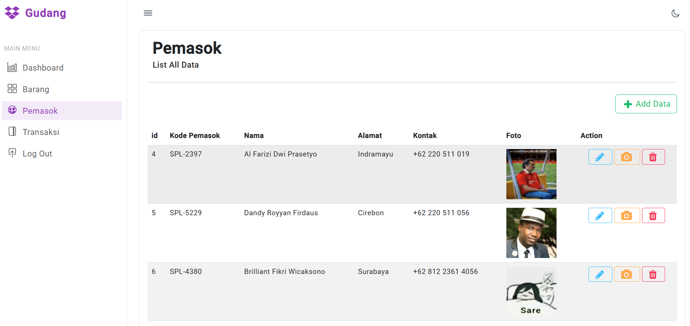

# Gudang Management System

Gudang Management System adalah aplikasi sederhana berbasis PHP Native yang dirancang untuk mengelola barang, pemasok, dan transaksi dalam sebuah gudang. Aplikasi ini memungkinkan pengguna untuk menambah, mengubah, menghapus, dan melihat data barang serta pemasok dengan mudah. *Project ini dibuat semata mata untuk Tugas Akhir Pemograman WEB*

## Fitur Utama
- **Manajemen Barang**: Tambah, ubah, hapus, dan lihat data barang.
- **Manajemen Pemasok**: Tambah, ubah, hapus, dan lihat data pemasok.
- **Transaksi Barang**: Catat transaksi masuk dan keluar barang.

## Teknologi yang Digunakan
- **PHP**: Versi 8.4.2
- **MySQL**: Untuk database
- **XAMPP/Laragon**: Sebagai server lokal

## Instalasi
Ikuti langkah-langkah berikut untuk menjalankan aplikasi ini di komputer Anda:

### 1. Clone Repository
Clone repository ini ke folder server lokal Anda:
```bash
git clone <url-repo>
```

### 2. Buat Database
- Buka phpMyAdmin atau alat manajemen database lainnya.
- Buat database baru dengan nama `db_gudang`.

### 3. Import File SQL
- Import file SQL yang terdapat di repository (`db/db_gudang.sql`) ke dalam database `db_gudang` yang telah dibuat.

### 4. Pindahkan Folder ke Server Lokal
- Pindahkan folder hasil clone ke direktori server lokal:
  - Untuk XAMPP: `htdocs/`
  - Untuk Laragon: `www/`

### 5. Jalankan Aplikasi
- Pastikan server lokal (Apache dan MySQL) telah aktif.
- Akses aplikasi melalui browser:
  ```
  http://localhost/nama-folder-project
  ```

## Screenshots
Berikut adalah tampilan dari aplikasi:

### Halaman Dashboard


## Catatan
- Pastikan PHP dan MySQL sudah terinstal di komputer Anda.
- Jika Anda menggunakan port selain default (80), tambahkan port tersebut saat mengakses aplikasi. Contoh: `http://localhost:8080/nama-folder-project`.

---
